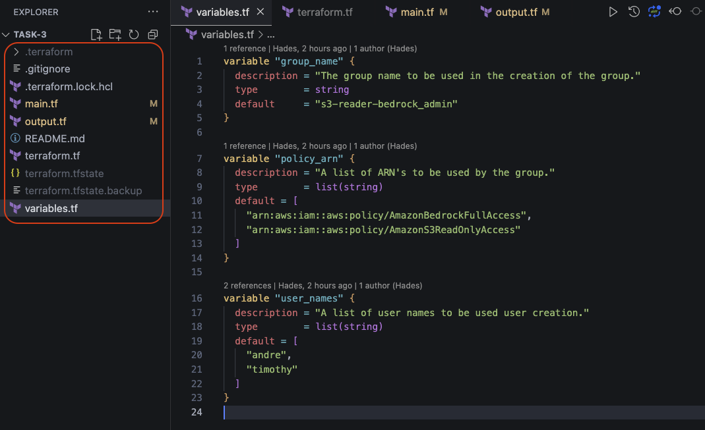
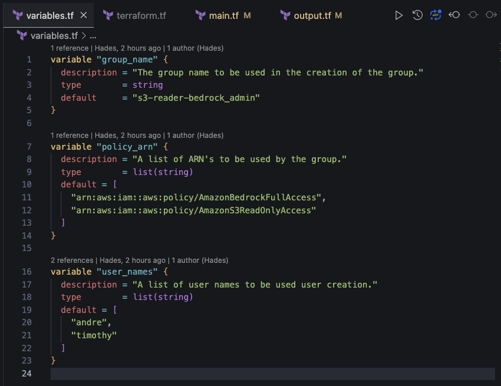
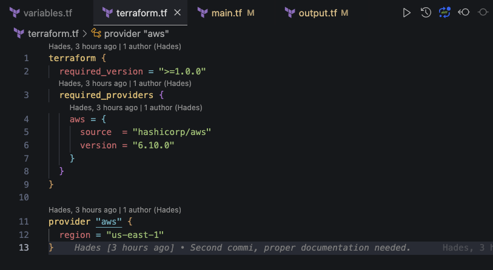
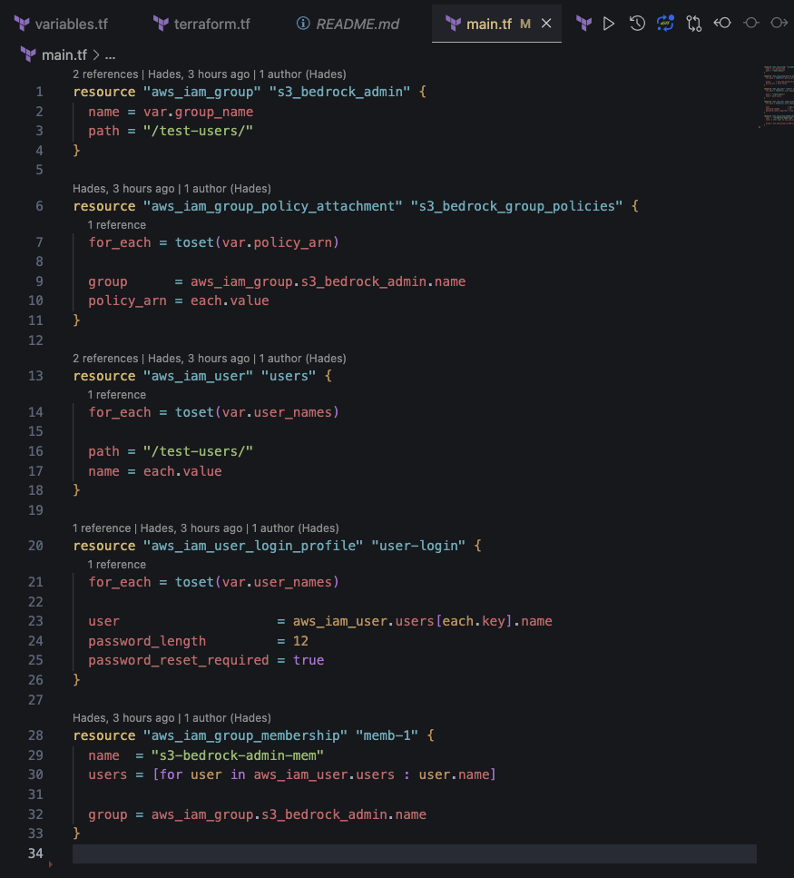
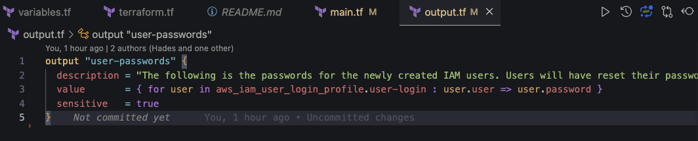
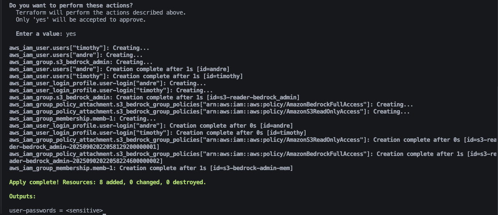
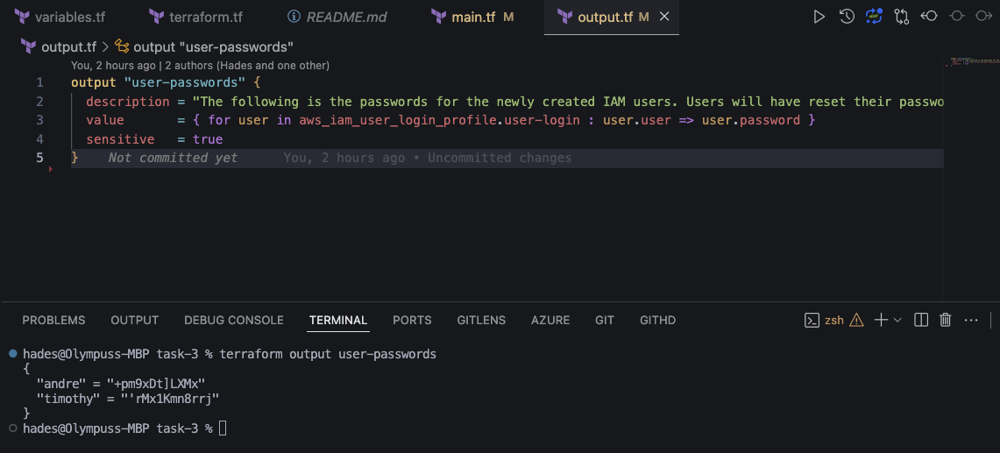
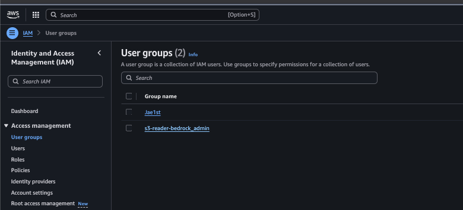
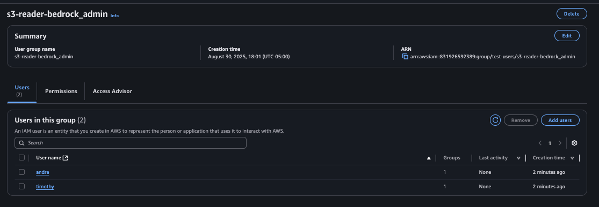
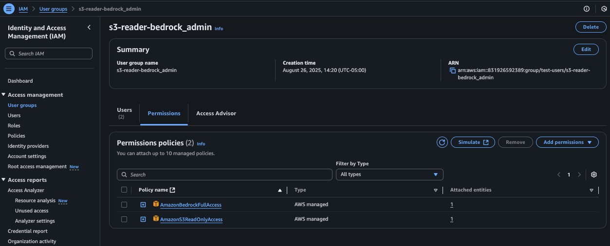

## Task 3:

"The Security team wants your help in streamlining user access. Within Terraform, create an IAM group with S3 reader access and Bedrock admin access. Then, create IAM users representing the people in your group, and assign those IAM users to the IAM group. The users require console access, but do not require a key. Do your best to incorporate variables within the Terraform code."

## Key takeaways from task

The following points from the above Task where guidelines for the creation of the terraform configuration: 
- **"create an IAM group with S3 reader access and Bedrock admin access"**
- **"create IAM users representing the people in your group, and assign those IAM users to the IAM group"**
- **"users require console access, but do not require a key"**
- **"Do your best to incorporate variables within the Terraform code."**

## Key goals/ targets for this Terraform Configuration

Welcome! To accomplish the given task, this terraform configuration is designed for AWS to enable the creation of: 
- **IAM Users** (with your desired names and amounts), 
- **IAM User profiles** (with autogenerated one time passwords), 
- **A User Group**, 
- **Attachment of created users to the created user group,** 
- and the attachment of **AWS IAM policies** to the created group; thus attaching the selected policies to the associated users.

Throughout the configuration, various built-in terraform functions will be used to reduce various coding repetitions and make resource creation easier on the coder (explanations will be provided where necessary).

## Terraform Configuration

### Overview of the .tf files

The primary configuration for this terraform task will be house in 4 .tf files (not necessary but, great for readability and understanding).

- the `terraform.tf` file will house the main  required and version and provider files compatible with this configuration.
- The `variables.tf` file will house the various variables used in this code, whose default values you can change to suit your needs.
- The `main.tf` file houses the main resources being created by this configuration, using the provided variable values
- The `output.tf` file will print out specified values (in this case the created user names and presence of the created login password).




### Contents of the  `terrraform.tf` file

This file contains variables for:
- the desired group name to be be created (under the block name `variable "group_name"`), 
- a variable for the desired policy(s) to be added to your group to be created (under the **variable block** `variable "policy_arn`) , 
- and the user(s) you want to create and attached to your created group (under the **variable block** `variable "user_names`).



Note that to add your desired users to be created, just replace the names with the name of each user you want to add under the default `default` section of the `user_name` variable. Each name should be in listed string format as indicated.

To assign your desired name to the group to be created, just replace the name under `default` wiht your desired name.

Tp assign your desired policies, replace the policy ARN's with the desired ARNs of you want to add under the default `default` section of the `policy_arn` variable. Each policy ARN should be in listed string format as indicated.


### Contents of the `terraform.tf` file

This file contains the provider and terraform versions that this configuration is compatible with.





### Contents of the `main.tf` file

This file's main purpose is the creations of the following AWS resources:

- **`aws_iam_group`**: This resource block will create the user group with the IAM group name you provided in the variable.

- **`aws_iam_group_policy_attachment`**: The resource links between the IAM group and the AWS managed policies that define its permissions. This resource will link your created IAM group the the policies you defined with the policy ARN's you provided in the variable

- **`aws_iam_user`**: This resource creates user accounts, one for each name you provided in a variable.

- **`aws_iam_user_login_profile`**: This resource will create a login profile for each user, granting them access to the AWS Management Console with a temporary password **that must be reset on first login**. This password length will be 12 characters.

- **`aws_iam_group_membership`**: This resource will create link that officially adds all the created users to the created IAM group.





#### Built-in functions & Key Concepts Explained

This code uses several important Terraform built-in functions for easier coding and to improve efficiency. Here’s how they function in this specific context.

##### **a. `for_each` and `toset()`**

`for_each` is a meta-argument that tells Terraform to create **multiple copies** of a resource based on a list or map. The `toset()` function is used here to convert the list of user names or policy ARNs into a set of unique strings, which `for_each` can then loop over.
    
- **Use in the code:**
    
    - `resource "aws_iam_user" "users"`: Instead of writing a separate `aws_iam_user` block for every single user, `for_each` reads the `var.user_names` list and creates one user resource instance for each name in the list.
    
    - `resource "aws_iam_group_policy_attachment" "s3_bedrock_group_policies"`: Similarly, this block uses `for_each` to loop over the `var.policy_arn` list and create one policy attachment for each ARN. This is a very clean way to attach multiple policies.
##### **b. The `for` Expression**

A `for` expression is a tool for **transforming data**. It loops over a list or map to create a _new_ list or map with modified contents .
    
- **Use in the code:**
    
    Terraform
  ```
    users = [for user in aws_iam_user.users : user.name]
    ```
    
    - The `aws_iam_group_membership` resource needs a simple list of user _names_ (strings).
    
    - However, `aws_iam_user.users` (the output from the `for_each` block) is a complex **map of user objects**, where each object contains a name, an ARN, a unique ID, etc.
    
    - The `for` expression is the perfect tool to bridge this gap. It iterates over the map of user objects and, for each one, it **extracts only the `.name` attribute**. It then collects all these name strings into a new, simple list that is in the exact format the `users` argument requires.

### The contents of the `output.tf` file

This file will create an output block that will print the passwords on the successful creation of the user profiles. Please note that, to adhere to security best practices, and since passwords are by default sensitive/ private information, they will be marked as sensitive. Thus on successful creation and completion out will give `(sensistive value)` as indicated below:


Example of the output block:




## Running the code

1. **Prepare Variables:** Create a `terraform.tfvars` file to define your `group_name`, `policy_arn`, and `user_names`. Or manually make changes in each default section with your desired information.
    
2. **Initialize:** Run `terraform init` to download the necessary AWS provider.
	
3. **Validate:**  Rum `terraform validate` to ensure the code with all your changes is syntactically correct and internally consistent.
    
4. **Plan:** Run `terraform plan` to see a preview of the resources that will be created.
    
5. **Apply:** Run `terraform apply` to create the IAM group, users, and memberships in your AWS account. At the end of the run you should have an output similar to the below:



With the output `user-name = <sensitive>`

6. **Retrieving the password:**  Please note that as the user passwords are sensitive information, the default output block (in the `output.tf` file) that calls for the passwords will not be automatically display after the successful `terraform apply` . It will however be saved to the state file, from where it an be retrieved with a `terraform output user-passwords` command in the terminal. Once this command is run you can then obtain the generated, one-time use, passwords.
**N.B. This is sensitive information and should be retrieved and treated with extreme care and caution.**




N.B. These are a one-time use passwords, that will compel a user password reset when initially used.


## Summary and default usage

This Terraform configuration is designed to streamline the onboarding of new users within an AWS account by automating the creation of IAM users and assigning them to a single, centrally managed IAM group. The code is flexible, allowing you to define the group name and provide a custom list of usernames as input variables. Permissions are applied to the group, and by **default**, it is configured with `AmazonBedrockFullAccess` and `AmazonS3ReadOnlyAccess`. If no specific users are provided, the configuration defaults to creating two users, **'andre'** and **'timothy'.** This approach ensures all users inherit a consistent and correct set of permissions, aligning with security best practices

Sample images:







---

## **Sources and Links**

**Terraform `for_each` Meta-Argument Documentation**: Official documentation explaining how to use `for_each` to create multiple instances of a resource from a map or a set of strings. * [https://developer.hashicorp.com/terraform/language/meta-arguments/for_each](https://developer.hashicorp.com/terraform/language/meta-arguments/for_each)

**Terraform `for` Expressions Documentation**: Official documentation explaining how `for` expressions are used for data transformation, creating a new complex value from an existing one. * [https://developer.hashicorp.com/terraform/language/expressions/for](https://developer.hashicorp.com/terraform/language/expressions/for)

**Terraform `toset()` Function Documentation**: Official documentation for the `toset` function, which converts a list of strings into a set, removing any duplicate elements and making it suitable for use with the `for_each` meta-argument.
 [https://developer.hashicorp.com/terraform/language/functions/toset](https://developer.hashicorp.com/terraform/language/functions/toset)