### Log into the cluster

 The first step will be to spin up our K8 cluster using the following commands in the terminal: terraform init, terraform validate, terraform plan, terraform apply 

 Once the Terraform apply command has successfully spun up the desired configuration, the next set will be to log into our K8 cluster using the following command “aws eks update-kubeconfig --region us-east-1 --name demo”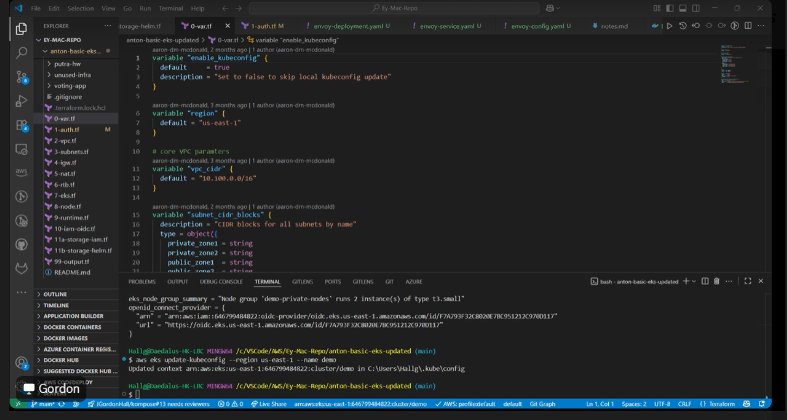

### Helm manifests for Prometheus, Grafana and Helm

**Once we’ve successfully logged into our cluster, the next step is to start deploying assets using Helm. The first step will be to adding/update our Helm chart using the following command. “helm repo add prometheus-community [https://prometheus-community.github.io/helm-charts](https://prometheus-community.github.io/helm-charts)” followed by “helm repo update"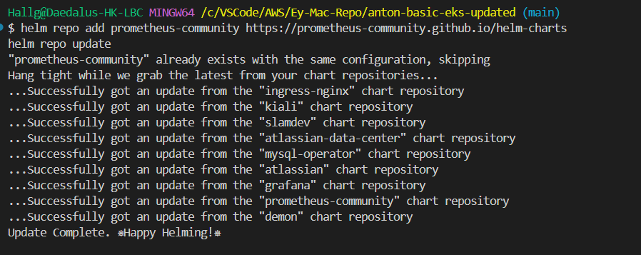
The next step is to enter the following helm command to create the observability namespace and to install Prometheus and Grafana to pods on the K8 cluster. This command installs the kube-prometheus-stack (Prometheus, Grafana, Alertmanager) into the observability namespace.It configures persistent storage: Prometheus (50GiB), Grafana, and Alertmanager (10GiB), all using the gp2 storage class. Prometheus, Grafana, and Alertmanager are exposed externally via the ELB (Elastic Load Balancer).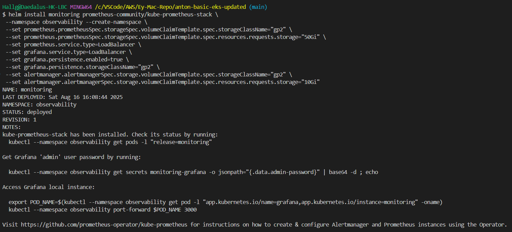
Once the previous commands have been entered, and the Prometheus/Grafana configuration have been successfully deployed, enter following commands to pull up the Prometheus and Grafana dashboards. Below are the commands to pull up the dashboards along with metrics to confirm Prometheus and Grafana are working c (Grafana dashboard credentials are Username: admin, Password: prom-operator)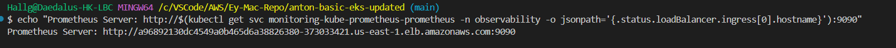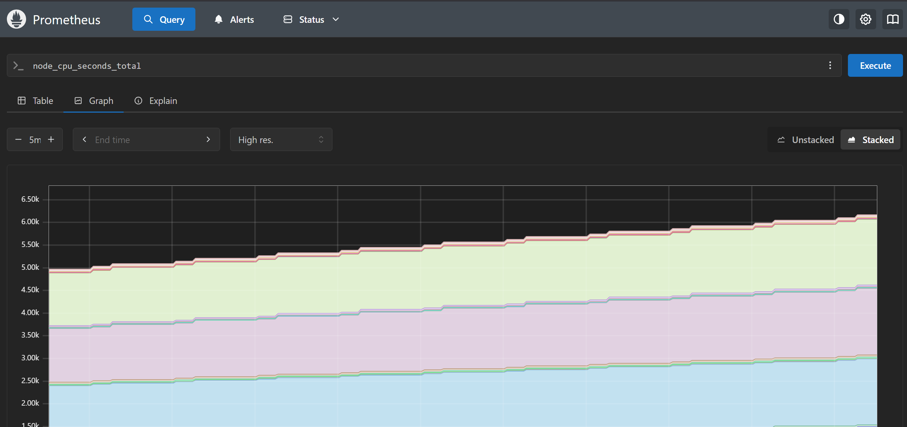
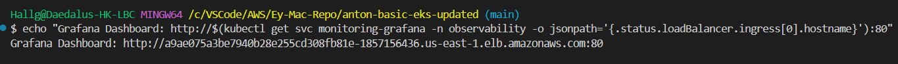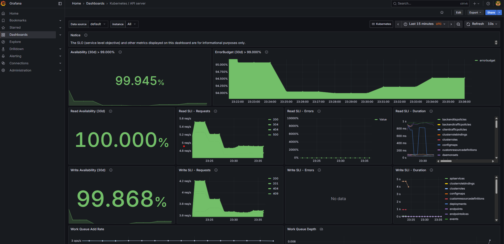![[Task 1 -10  Grafana Dashboard -K8 Compute Resources Cluster.png
 The next step once Prometheus and Grafana are successfully deployed is to get Envoy up and running. “helm install eg oci://docker.io/envoyproxy/gateway-helm --version v0.0.0-latest -n envoy-gateway-system --create-namespace” This will install the Envoy Gateway Helm chart from Docker Hub OCI registry, with release name “eg”, into the namespace envoy-gateway-system. (Envoy Gateway is a Kubernetes-native control plane for Envoy Proxy. It lets you run Envoy as an ingress or API gateway using the Kubernetes Gateway API, without writing raw Envoy config. Envoy Gateway automatically deploys and manages Envoy proxies, making it easy to expose services securely with built-in routing, TLS, and observability.)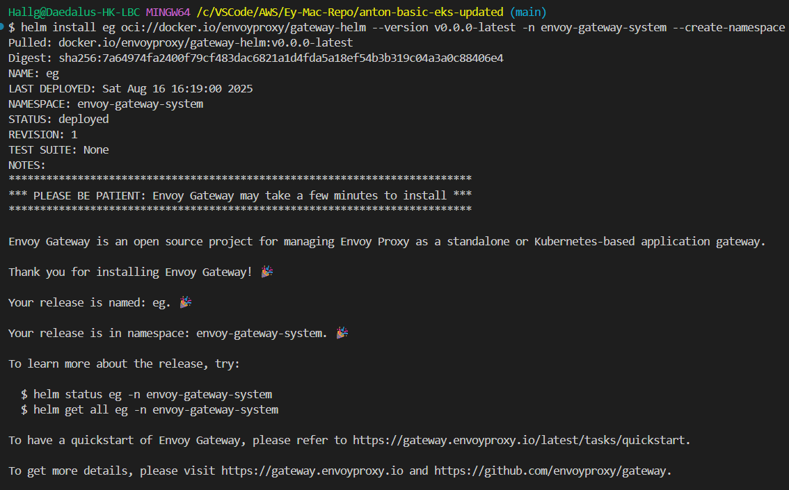
 Next, check the status of your pods to confirm that the envoy deployment is running properly. Once you’ve performed this step, and confirmed that your deployment is running, you can move on to the next step. Based on the current output, the Envoy Gateway is running but the Envoy Proxy isn't. Once the Envoy Gateway Admin UI is up, we’ll ensure the Envoy Proxy is spun up in kind.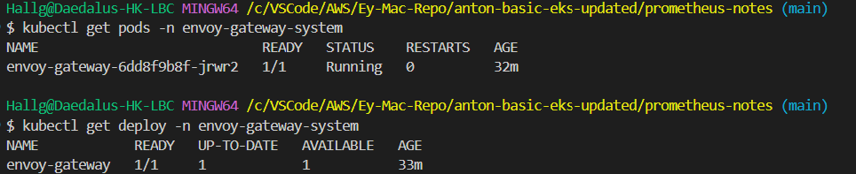
 Enter the following kubectl command to port forward the Envoy gateway to port 19000 doing this will allow you access the Admin UI via Localhost:19000(kubectl port-forward deploy/envoy-gateway -n envoy-gateway-system 19000)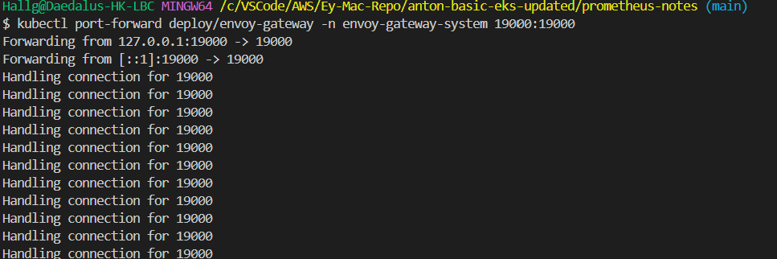
 Next, once port-forwarding has been initiated, enter in a browser window to access the Envoy Admin UI (Localhost:19000), from there click “server info” to get confirmation that the envoy-gateway pod is running within the EKS cluster.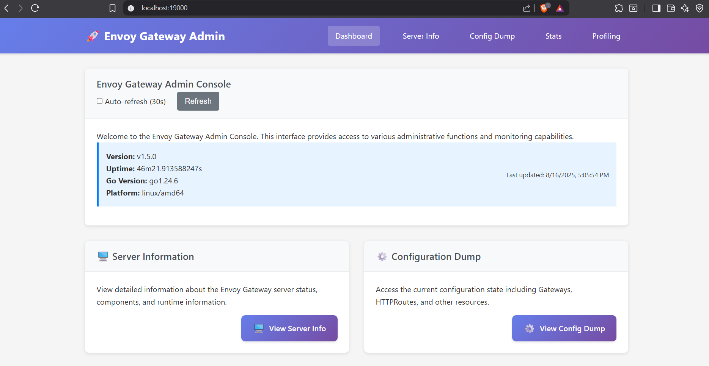
 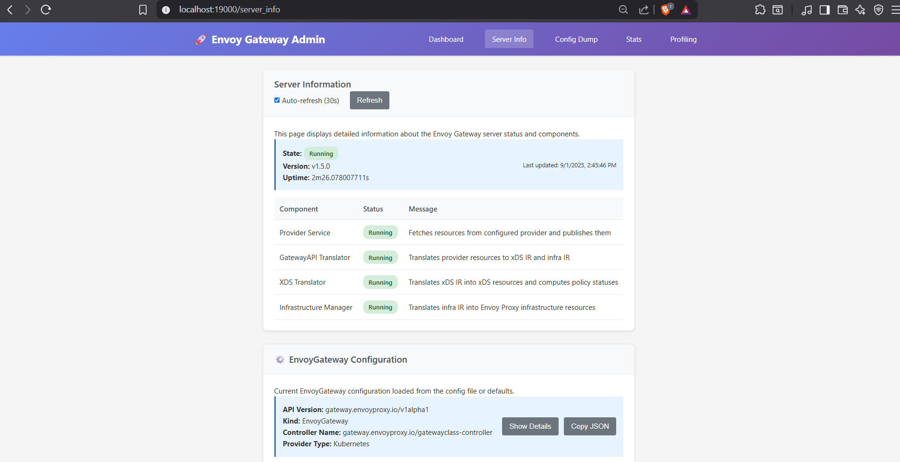
 The next step is to ensure the Envoy Proxy is running correctly. A simple way to do this is to trigger the envoy-default-eg pod to be created in the data plane. We can do this by creating a GatewayClass yaml file and applying it. However, keeping in line with desire for automation, lets forgo the creation of a yaml file and simply apply the “Heredoc” (A Heredoc (short for here document) is a way to pass a block of text to a command in a shell (like Bash) without putting it in a separate file) method of performing this action which combines creating the yaml and applying it to one action (*10-A). Next enter the Kubectl command 
```
(kubectl get gatewayclass eg -o jsonpath='{.status.conditions[?(@.type=="Accepted")].status}'; echo) to confirm the Heredoc command worked (The desired output should be “True“
```

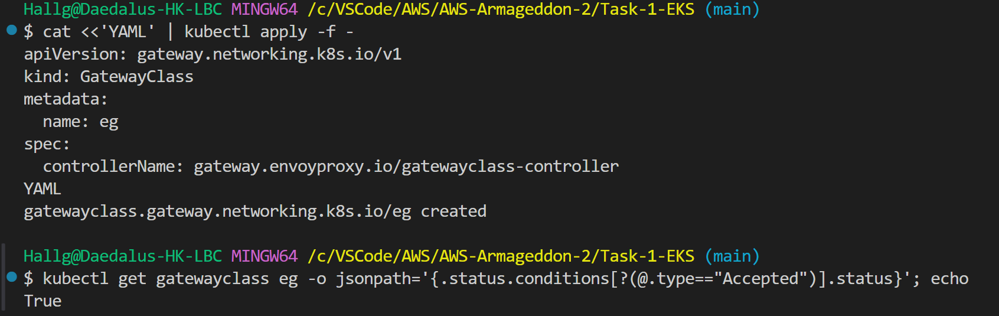
 The next Heredoc command (11-A) tells Kubernetes to (Spin up an Envoy proxy for me (via Envoy Gateway) that listens on port 80 for HTTP traffic (using the GatewayClass created earlier) running this command will trigger the envoy-default-eg pod to appear** 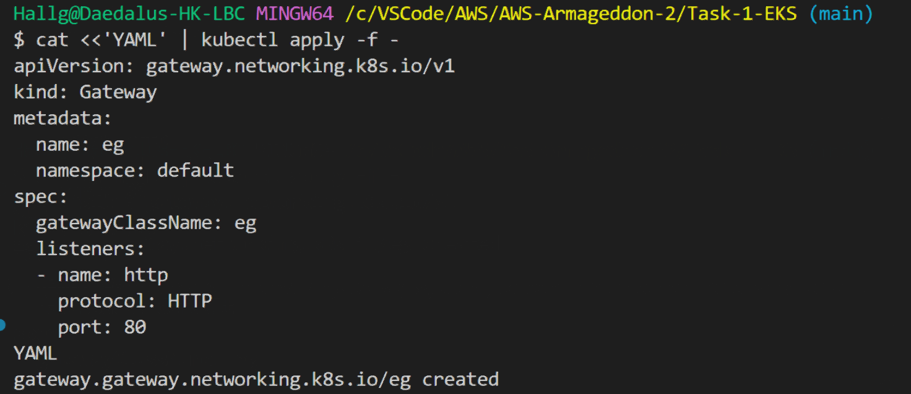
 **Run (kubectl get pods  -n envoy-gateway-system) to confirm whether the envoy-default-eg pod is running. Based on the output, we can confirm that both gateway and the default Envoy pods are running. With the envoy-default-eg pod running, we’ve successfully installed envoy with helm and created the envoy default pod with Heredoc commands and are currently running Envoy on our EKS Cluster.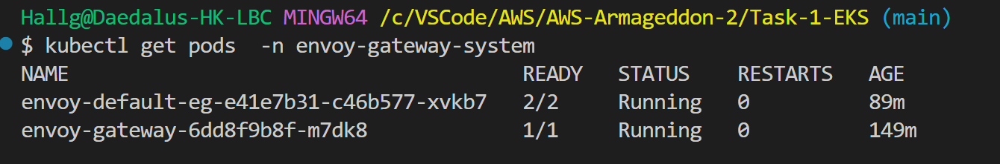
 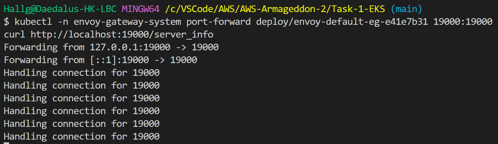
 For bonus points, we can initiate port forwarding to port 19000, and access the Envoy Proxy UI (kubectl -n envoy-gateway-system port-forward deploy/envoy-default-eg-e41e7b31 19000:1900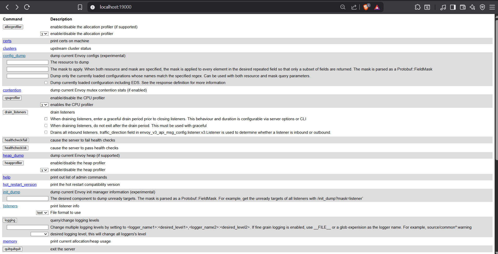
 Now that we’ve successfully spun up Envoy, lets begin to tear down our deployment. Start with uninstalling Envoy via Helm with the following command (helm uninstall eg -n envoy-gateway-system)****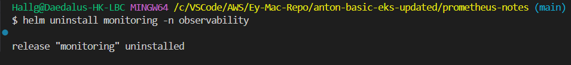
 **Next, since we’re tearing everything in the cluster down, teardown the envoy namespace with the following command (kubectl delete namespace envoy-gateway-system)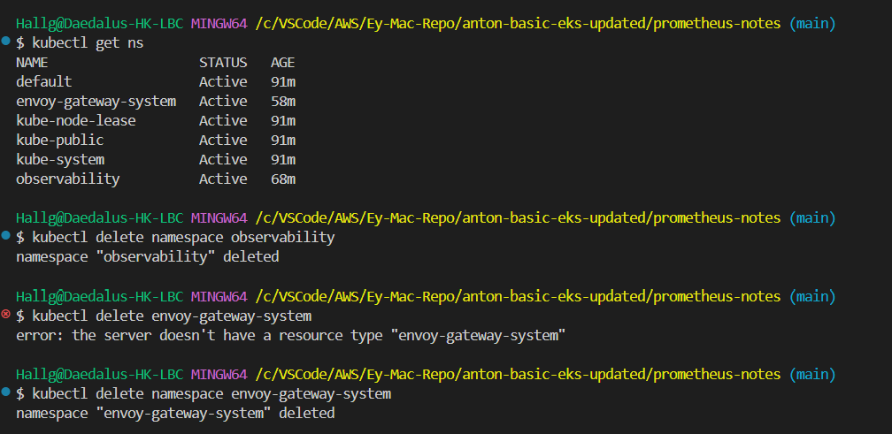
 Confirm all namespaces associated with Envoy have been destroyed
 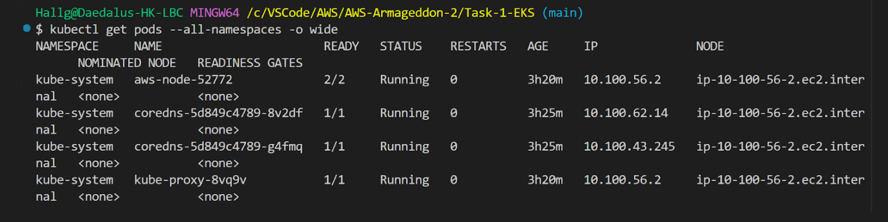
 Finally, we can tear down our K8 cluster via Terraform using Terraform Destroy
 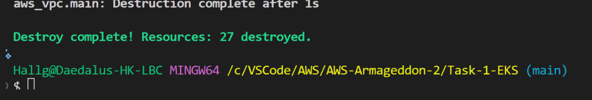


```
HereDoc Command List:

10-A(Tells EG to Manage Gateways): cat <<'YAML' | kubectl apply -f -

apiVersion: gateway.networking.k8s.io/v1

kind: GatewayClass

metadata:

  name: eg

spec:

  controllerName: gateway.envoyproxy.io/gatewayclass-controller

YAML

gatewayclass.gateway.networking.k8s.io/eg created

  
  

11-A(Triggers creation of the Envoy data-plane Deployment/Service):

cat <<'YAML' | kubectl apply -f -

apiVersion: gateway.networking.k8s.io/v1

kind: Gateway

metadata:

  name: eg

  namespace: default

spec:

  gatewayClassName: eg

  listeners:

  - name: http

    protocol: HTTP

    port: 80

YAML

```
